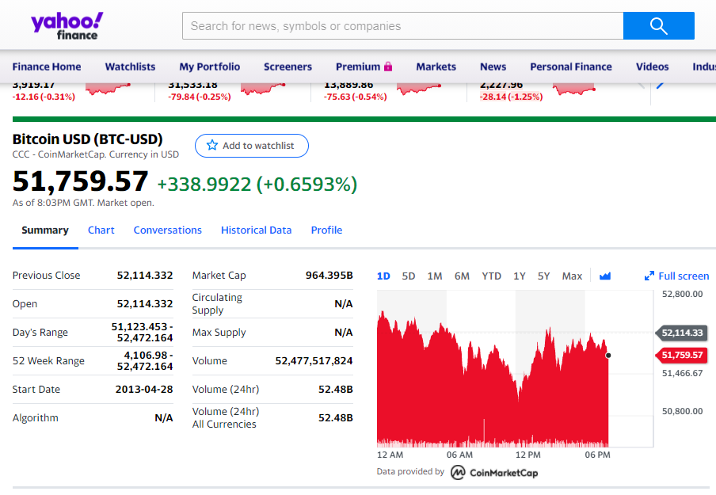
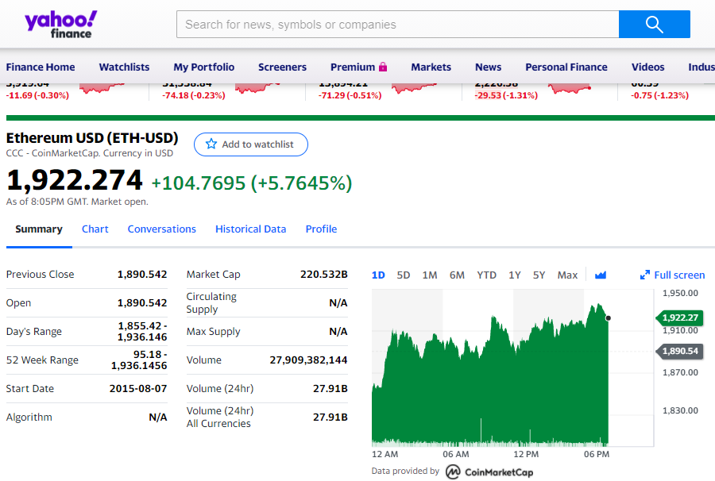

```{r setup, include=FALSE}
knitr::opts_chunk$set(echo = TRUE)
options(scipen = 999)
source("funciones/funciones.R", local = knitr::knit_global())
```

# **Compresión del negocio**

<div style="text-align: justify"> 
Sin duda alguna, los meses anteriores han sido muy importantes en la bolsa de criptomonedas debido al alza continua, principalmente del Bitcoin. 
Noticias van y vienen sobre este tema y esto genera muchas dudas en las personas que quieren invertir en este tipo de activos. 

Teniendo en cuenta lo anterior, en el presente proyecto intenta predecir el precio de dos criptomonedas, Bitcoin y Ethereum.

Estas dos criptomonedas se encuentran entre las criptomonedas de mejor rendimiento y que han tenido un alza importante en los últimos meses. 

Para esto será necesario aplicar los conocimientos obtenidos del programa de minería de datos, específicamente en el área de series de tiempo. 

**¿Qué es Bitcoin?**

<i>Bitcoin es una red consensuada que permite un nuevo sistema de pago y una moneda completamente digital. Es la primera red entre pares de pago descentralizado impulsado por sus usuarios sin una autoridad central o intermediarios. Desde un punto de vista de usuario, Bitcoin es como dinero para Internet. Bitcoin puede ser el único sistema de contabilidad triple existente. 

Desde la perspectiva del usuario, Bitcoin no es más que una aplicación móvil o de escritorio que provee un monedero Bitcoin personal y permite al usuario enviar y recibir bitcoins con el. Así es como funciona Bitcoin para la mayoría de los usuarios.

Detrás de las cámaras, la red Bitcoin comparte una contabilidad pública llamada "block chain". Esta contabilidad contiene cada transacción procesada, permitiendo verificar la validez de cada transacción. La autenticidad de cada transacción esta protegida por firmas digitales correspondientes a las direcciones de envío, permitiendo a todos los usuarios tener control total al enviar Bitcoins desde sus direcciones Bitcoin. Además, cualquiera puede procesar una transacción usando el poder computacional de hardware especializado y conseguir una recompensa en Bitcoins por este servicio. Esto es comúnmente llamado "mining" o minería. Para aprender más sobre Bitcoin, puedes consultar la página dedicada y el documento original.

Fuente: https://bitcoin.org/es

**¿Qué es Ethereum?**
</i> 

<i> 

Ethereum es una tecnología que te permite enviar criptomonedas a cualquier persona por una pequeña comisión. También potencia aplicaciones que cualquiera puede usar y nadie puede derribar.

Es la blockchain programable del mundo.

Ethereum se construye sobre la innovación de Bitcoin, pero con grandes diferencias.

Ambos utilizar dinero digital sin proveedores de pago o bancos. Pero Ethereum es programable, así que también puedes utilizarlo para diferentes activos digitales, incluido Bitcoin.

Esto también significa que Ethereum es más que pagos. Ethereum es un mercado de servicios financieros, juegos y aplicaciones que no pueden robar tu información o censurarte.

Es habitual confundir Ethereum y ETH. Ethereum es la cadena de bloques y ETH (Ether) es el activo principal de Ethereum.

Fuente: https://ethereum.org/es/

</i> 
</div>


## **Objetivo General**

<div style="text-align: justify"> 
+ Predecir el precio de criptomonedas del Bitcoin y Ethereum en dólares 
</div>

## **Objetivos específicos**

<div style="text-align: justify"> 
+ Utilizar la mayor cantidad de métodos predictivos para series de tiempo vistos en clase, y compararlos.
+ Seleccionar el mejor método de predicción para Bitcoin como para Ethereum.
</div>

# **Compresión de los datos**

<div style="text-align: justify"> 
El historial de datos a utilizar comprende desde Octubre 2014 a la fecha para Bitcoin y desde Septiembre del 2015 a la fecha para el Ethereum. 

Las variables (columnas) en ambas tablas de datos serían las siguientes: 
<br/> a. Date <br/> b. Open <br/> c. High <br/> d. Low <br/> e. Close <br/> f. Adj Close <br/> g. Volume <br/> 

Los individuos (filas) comprenden información histórica diaria desde 2014 para Bitcoin y desde 2015 para Ethereum

Para la tabla de datos, la cual comprende información histórica diaria del Bitcoin, la dimensión sería de 2,332 individuos y 7 variables. Si se agrupa por mes tendriamos un total de 78 individuos. 

Mientras para la tabla de datos, la cual comprende información histórica diaria del Ethereum, la dimensión sería de 2,008 individuos y 7 variables. Si se agrupa por mes tendriamos un total de 67 individuos. 

La variable a predecir tanto para el Bitcoin como para el Ethereum sería la variable Close. Esto porque, es la variable que indica cual fue el precio de cierre de estas criptomonedas.
</div>

## **Recolección de los datos**

<div style="text-align: justify">
La recolección de datos se realiza desde la plataforma de  *<mark>yahoo finance</mark>*, especificamente de las siguientes páginas web. <br/> 
<br/> a. https://finance.yahoo.com/quote/BTC-USD 

<center>

</center>

<br/> b. https://finance.yahoo.com/quote/ETH-USD

<center>

</center>
</div>

# **Bitcoin (BTC)**

## **Descripción de los datos**

### Carga de datos

<div style="text-align: justify"> 
Se realiza la carga del conjunto de datos de la inforamción de Bitcoin. Adicionlamnete se define el patron de estacionalidad anual con fecruencia 12 debido a que los datos son mensuales por cada año. 
</div>

```{r message=FALSE, warning=FALSE}
library(DT)
Sys.setlocale("LC_TIME", "Spanish")

dataset.btc <- read.csv(file = "datos/BTC-USD_M.csv", head = TRUE, sep=",")
DT::datatable(dataset.btc)

valor_frecuencia = 12

```


<div style="text-align: justify"> 
Seguidamente se presentará la descripción de los datos para Bitcoin

+ Date: Columna que muestra la fecha en formato yyyy-mm-dd
+ Open: Precio de apertura 
+ High: Precio más alto
+ Low: Precio más bajo 
+ Close: Precio de clausura 
+ Adj Close:  Precio de clausura con ajustes
+ Volume: Volumen de monedas intercambiadas
</div>

## **Exploración de los datos**

### Exploración de los datos
```{r message=FALSE, warning=FALSE}
summary(dataset.btc)
str(dataset.btc)
```

## **Preparación de los datos**

### Formateo de los datos

```{r message=FALSE, warning=FALSE}
library(lubridate)

dataset.btc[dataset.btc == 'null'] <- NA
dataset.btc$Date      <- ymd(dataset.btc$Date) 
dataset.btc$Open      <- as.numeric(as.character(dataset.btc$Open))
dataset.btc$High      <- as.numeric(as.character(dataset.btc$High))
dataset.btc$Low       <- as.numeric(as.character(dataset.btc$Low))
dataset.btc$Close     <- as.numeric(as.character(dataset.btc$Close))
dataset.btc$Adj.Close <- as.numeric(as.character(dataset.btc$Adj.Close))
dataset.btc$Volume    <- as.numeric(as.character(dataset.btc$Volume))
DT::datatable(dataset.btc)
```

### Correción de fechas e imputación 

```{r message=FALSE, warning=FALSE}
library(dplyr)

fecha.inicio <- dataset.btc$Date[1]
fecha.final  <- dataset.btc$Date[nrow(dataset.btc)]

total.fechas <- seq(fecha.inicio, fecha.final, by = "month") 

faltan.fechas <- total.fechas[!total.fechas %in% dataset.btc$Date]
faltan.fechas

dataset.btc <- dplyr::union_all(dataset.btc, data.frame(Date = faltan.fechas))
dataset.btc <- dataset.btc[order(dataset.btc$Date), ]

dataset.btc$Open[is.na(dataset.btc$Open)] <- mean(dataset.btc$Open, na.rm = T)
dataset.btc$High[is.na(dataset.btc$High)] <- mean(dataset.btc$High, na.rm = T)
dataset.btc$Low[is.na(dataset.btc$Low)] <- mean(dataset.btc$Low, na.rm = T)
dataset.btc$Close[is.na(dataset.btc$Close)] <- mean(dataset.btc$Close, na.rm = T)
dataset.btc$Adj.Close[is.na(dataset.btc$Adj.Close)] <- mean(dataset.btc$Adj.Close, na.rm = T)
dataset.btc$Volume[is.na(dataset.btc$Volume)] <- mean(dataset.btc$Volume, na.rm = T)

summary(dataset.btc)

```


### Normalidad de la serie

```{r message=FALSE, warning=FALSE}
library(ggplot2)
library(tseries)

dia.inicio <- which(dataset.btc$Date == "2014-10-01") 
dia.inicio

serie.btc <- ts(dataset.btc$Close, frequency = valor_frecuencia, start = c(2014, 10)) 
#Patrón Estacional Anual. Frecuencia 12. Los datos vienen mensuales

serie.btc

h <- hist(diff(serie.btc), plot = T)
x <- seq(min(h$mids, na.rm = T), max(h$mids, na.rm = T), length = length(serie.btc))
promedio   <- mean(diff(serie.btc), na.rm = T)
desviacion <- sd(diff(serie.btc), na.rm = T)
normalidad <- dnorm(x, promedio, desviacion)

ggplot() + 
  geom_histogram(aes(x = diff(serie.btc), y = ..density..), bins = 90, color = "white") + 
  geom_density(aes(x = diff(serie.btc), y = ..density.., color = "Densidad"), size = 1) +
  geom_line(aes(x = x, y = normalidad, color = "Normalidad"), size = 1)
```

### Test qqnorm y  test qqline

```{r message=FALSE, warning=FALSE}
qqnorm(diff(serie.btc))
qqline(diff(serie.btc), col = "red")
```

### Test de normalidad

+ Test chi-square de Pearson

```{r message=FALSE, warning=FALSE}
library(nortest)
pearson.test(serie.btc)$p.value
```

+ Test Lilliefors (Kolmogorov-Smirnov)

```{r message=FALSE, warning=FALSE}
library(nortest)
lillie.test(serie.btc)$p.value
```

+ Test de Cramer-von Mises

```{r message=FALSE, warning=FALSE}
library(nortest)
cvm.test(serie.btc)$p.value
```

<div style="text-align: justify"> 
Los tres tests nos dan un valor de p <= 0.05 (p-value  <=  0.05), es decir por debajo del nivel de significancia de 0.05.  Por lo que existe  evidencia estadística para aceptar la hipotesis de que la muestra  *<mark>NO</mark>* proviene de una distribución normal. Es decir, podemos afirmar que la “serie” no sigue una distribución normal.

Adicionalmente, los gráficos de normalidad no indican que los datos siguen la normal. 
</div>

### Descomposición de la serie 

```{r message=FALSE, warning=FALSE}
library(forecast)

forecast::autoplot(stl(serie.btc, s.window = "periodic"))
```

### Periodos más importantes

```{r message=FALSE, warning=FALSE}
library(dygraphs)
res <- spec.pgram(serie.btc, log = "no", plot = F)

#Ordena el espectro con respecto a la frecuencia en orden decreciente es decir de mayor a menor, 
#el valor 1 no se toma en cuenta pues es toda la serie

max <- order(res$spec, res$freq, decreasing = TRUE) 

max <- max[max != 1][1:3] # Ignoramos la posición 1 y tomamos las 3 primeras posiciones.
max

# Los periodos más importantes son
periodos <- valor_frecuencia/max
periodos

ggplot() + geom_line(aes(x = res$freq, y = res$spec)) + 
  geom_vline(xintercept = max[1], linetype = "dashed", color = "palegreen3") +
  geom_vline(xintercept = max[2], linetype = "dashed", color = "pink") +
  geom_vline(xintercept = max[3], linetype = "dashed", color = "navy")

dygraphs::dygraph(res, 'Peridiograma', 'Frecuencia', 'Espectro', width = "100%") %>%
  dyEvent(max[1], color = "green") %>%
  dyEvent(max[2], color = "red") %>%
  dyEvent(max[3], color = "navy") %>%
  dyUnzoom() %>% 
  dyCrosshair(direction = "vertical") %>%
  dyRangeSelector(height = 20, strokeColor = "black", fillColor = "black", )

```

<div style="text-align: justify"> 
Determinamos que el periodo más importante es de 6.
</div>


### Gráfico de la serie

```{r message=FALSE, warning=FALSE}
library(dygraphs)
library(xts)

aux <- xts::xts(serie.btc, order.by = as.Date(dataset.btc$Date))
dygraphs::dygraph(aux, main = "Precio del Bitcoin mensual desde el año 2014 al 2021", xlab = "Año", width = "100%") %>%
  dyAxis("y", label = "Precio($)") %>%
  dySeries("V1", label = "Precio($)", color = "#6FC0B3") %>%
  dyLegend(show = "follow") %>%
  dyUnzoom() %>% 
  dyCrosshair(direction = "vertical") %>%
  #dyOptions(colors = RColorBrewer::brewer.pal(3, "Set2"))  %>%
  dyRangeSelector(height = 20, strokeColor = "black", fillColor = "black")


```

## **Modelado** 

### Serie en train y test

```{r message=FALSE, warning=FALSE}
serie.btc.train <- head(serie.btc, -valor_frecuencia)
serie.btc.test <- tail(serie.btc, valor_frecuencia)

```

## **Construcción de modelos básico**


### Método promedio
```{r message=FALSE, warning=FALSE}
metodo.promedio <- meanf(serie.btc.train, h = valor_frecuencia)
pred.promedio   <- forecast(metodo.promedio, h = valor_frecuencia)
```


### Método Naive
```{r message=FALSE, warning=FALSE}
metodo.naive <- naive(serie.btc.train, h = valor_frecuencia)
pred.naive   <- forecast(metodo.naive, h = valor_frecuencia)
```

### Método SNaive
```{r message=FALSE, warning=FALSE}
metodo.snaive <- snaive(serie.btc.train, h = valor_frecuencia)
pred.snaive   <- forecast(metodo.snaive, h = valor_frecuencia)
```

### Método Drift
```{r message=FALSE, warning=FALSE}
metodo.drift<- rwf(serie.btc.train, h = valor_frecuencia, drift = T)
pred.drift  <- forecast(metodo.drift, h = valor_frecuencia)
```

### Método STL
```{r message=FALSE, warning=FALSE}
metodo.stl <- stl(serie.btc.train, s.window = "periodic")
pred.stl   <- forecast(metodo.stl, h = valor_frecuencia)
```


## **Evaluación de modelos básicos**

```{r message=FALSE, warning=FALSE}
library(xts)
library(forecast)
library(dygraphs)

errores <- tabla.errores(
  predicciones = list(pred.promedio$mean, pred.naive$mean, pred.snaive$mean, pred.drift$mean, pred.stl$mean),
  real = serie.btc.test,
  c("Promedio", "Naive", "S Naive", "Desvio", "Descomposición")
)

errores
grafico.errores(errores)

predicciones <- ts.union(
  serie.btc.train, Original = serie.btc.test, 
  'promedio' =       pred.promedio$mean,  'Naive' =          pred.naive$mean,
  'S Naive' =        pred.snaive$mean,
  'Desvio' =         pred.drift$mean,
  'Descomposición' = pred.stl$mean
)


predicciones <- xts(xts(predicciones, order.by = as.Date(dataset.btc$Date)))

dygraphs::dygraph(predicciones, main = "Predicción del precio del Bitcoin mensual con modelos básicos", width = "100%") %>%
  dyRangeSelector() %>%
  dyLegend(width = 800) %>% #show = "follow", 
  dyUnzoom() %>% 
  dyCrosshair(direction = "vertical") %>%
  dyRangeSelector(height = 20, strokeColor = "black", fillColor = "black")
```

<div style="text-align: justify"> 
A pesar de varios modelos básicos poseen un RMSE y MSE bajos ninguno de los modelos aplicados anterionmente realmente el precio del Ethereum utilizanto 12 meses como prueba.
</div>


## **Construcción de modelos avanzados**

### Holt-Winters


```{r message=FALSE, warning=FALSE}
metodo.holtw <- stats::HoltWinters(serie.btc.train)
pred.holtw   <- forecast(metodo.holtw, h = valor_frecuencia) #n.ahead
 
```

#### Calibración Holt-Winters
```{r message=FALSE, warning=FALSE}
library(stats)
library(forecast)

calibrar.HW(serie.btc.train, serie.btc.test) 

metodo.holtw.calibrado <- stats::HoltWinters(serie.btc.train, alpha = 0.2, beta = 1,  gamma = 1)
pred.holtw.calibrado   <-   forecast(metodo.holtw.calibrado, h = valor_frecuencia) #n.ahead
```


### Redes Neuronales

```{r message=FALSE, warning=FALSE}
library(stats)
library(forecast)

metodo.nnet <- nnetar(serie.btc.train, size =30)
pred.nnet <- forecast(metodo.nnet, h = valor_frecuencia, PI = T)
```

### Arima

#### Autocorrelación Simple y Autocorrelación Parcial
```{r message=FALSE, warning=FALSE}
acf(serie.btc)
pacf(serie.btc)
```


<div style="text-align: justify"> 
El gráfico ACF y el gráfico PACF no muestran ciclicidad importante ni correlaciones parciales significativas. Lo anterior dificulta  buscar el mejor modelo ARIMA(p,d,q)(P,D,Q)_s a partir de estos dos gráficos, por lo que se prefiere hacerlo con auto.arima y con calibración con Fuerza Bruta.
</div>

#### Auto-Arima 


```{r message=FALSE, warning=FALSE}
auto.arima(serie.btc.train)

metodo.arima <- arima(serie.btc.train, order = c(0, 1, 0), list(order = c(0, 0, 0), period = 6)) #Periodo más importante
pred.arima   <- predict(metodo.arima, n.ahead = valor_frecuencia)
```

#### Calibración periodo 6

```{r message=FALSE, warning=FALSE}

calibrar.arima(serie.btc.train, serie.btc.test, periodo = 6.0, 0:3, 0:2) 

metodo.arima.6 <- arima(serie.btc.train, order = c(3, 3, 0), seasonal = list(order = c(0, 1, 0), period = 6))

pred.arima.6 <- forecast(metodo.arima.6, h = valor_frecuencia)
pred.arima.6
```

#### Calibración periodo 3

```{r message=FALSE, warning=FALSE}

calibrar.arima(serie.btc.train, serie.btc.test, periodo = 3.0, 0:3, 0:2) 

metodo.arima.3 <- arima(serie.btc.train, order = c(3, 3, 1), seasonal = list(order = c(0, 2, 0), period = 3))

pred.arima.3 <- forecast(metodo.arima.3, h = valor_frecuencia)
pred.arima.3
```

#### Calibración periodo 2.4

```{r message=FALSE, warning=FALSE}

calibrar.arima(serie.btc.train, serie.btc.test, periodo = 2.4, 0:3, 0:2) 

metodo.arima.2.4 <- arima(serie.btc.train, order = c(3, 1, 3), seasonal = list(order = c(0, 1, 1), period = 2.4))

pred.arima.2.4<- forecast(metodo.arima.2.4, h = valor_frecuencia)
pred.arima.2.4
```


## **Evaluación de modelos avanzados**

```{r message=FALSE, warning=FALSE}
library(xts)
library(dygraphs)

errores <- tabla.errores(
  predicciones = list(pred.holtw$mean, pred.holtw.calibrado$mean, pred.nnet$mean, pred.arima$pred, pred.arima.6$mean, pred.arima.3$mean, pred.arima.2.4$mean),
  real = serie.btc.test, 
  c("Holt-Winters", "HW Fuerza Bruta", "Redes Neuronales", "Auto.Arima", "Arima 6", "Arima 3", "Arima 2.4")
 
)

errores
grafico.errores(errores)

# Primero unimos en una sola tabla la serie original con las predicciones.
serie.pred <- ts.union(serie.btc.train, 
                       Original = serie.btc.test, 
                       'Holt-Winters' = pred.holtw$mean, 
                       'HW Fuerza Bruta' = pred.holtw.calibrado$mean, 
                       'Redes Neuronales' = pred.nnet$mean,
                       'Auto.Arima' = pred.arima$pred,
                       'Arima 6' = pred.arima.6$mean, 
                       'Arima 3' = pred.arima.3$mean, 
                       'Arima 2.4' = pred.arima.2.4$mean)

serie.pred <- xts(xts(serie.pred, order.by = as.Date(dataset.btc$Date)))

dygraphs::dygraph(serie.pred, main = "Predicción del precio del Bitcoin mensual con modelos avanzados", width = "100%") %>%
  dyRangeSelector() %>%
  dyLegend( width = 800) %>% #show = "follow",
  dyUnzoom() %>% 
  dyCrosshair(direction = "vertical") %>%
  dyRangeSelector(height = 20, strokeColor = "black", fillColor = "black")
```


## **Selección del mejor modelo**

<div style="text-align: justify"> 
Seleccionamos el mejor modelo y realizamos una nueva predicción utilizando toda la serie de tiempo. En este caso utilizaremos Arima calibrado con el periodo 6. 

Se determina que  Arima calibrado con el periodo 6, es el modelo que presenta mayor porcentaje de veces en las que el pronóstico fue mayor o igual a la realidad (PFA), menor porcentaje de fallos hacia arriba en términos absolutos, y es uno de los modelos con menor MSE y RMSE.
</div>


```{r message=FALSE, warning=FALSE}
library(dygraphs)

metodo.arima.6 <- arima(serie.btc, order = c(3, 3, 0), seasonal = list(order = c(0, 1, 0), period = 6))

pred.arima.6 <- forecast(metodo.arima.6, h = 6, level = c(95))
pred.arima.6

prediccion <- ts.union(
  pred.arima.6 = pred.arima.6$mean, LimInf = pred.arima.6$lower, LimSup = pred.arima.6$upper
)

serie.final <- ts.union(serie.btc, prediccion)
head(serie.final)

fecha.fin <- dataset.btc$Date[nrow(dataset.btc)]
fechas <- fecha.fin + months(1:6)
total.fechas <- c(dataset.btc$Date, fechas) 

serie.final <- xts(xts(serie.final, order.by = total.fechas))

dygraphs::dygraph(serie.final, main = "Predicción Bitcoin para los próximos 6 meses", xlab = "Año", width = "100%") %>%
  dyAxis("y", label = "Precio($)") %>%
  dySeries(c("prediccion.LimInf", "prediccion.pred.arima.6", "prediccion.LimSup"), label = "Predicción") %>%
  dyLegend(show = "follow") %>% 
  dyUnzoom() %>% 
  dyCrosshair(direction = "vertical") %>%
  dyRangeSelector(height = 20, strokeColor = "black", fillColor = "black")
```


# **Ethereum (ETH)**

## **Descripción de los datos**

### Carga de datos

<div style="text-align: justify"> 
Se realiza la carga del conjunto de datos de la inforamción de Bitcoin. Adicionlamnete se define el patron de estacionalidad anual con fecruencia 12 debido a que los datos son mensuales por cada año. 
</div>


```{r message=FALSE, warning=FALSE}
library(DT)
Sys.setlocale("LC_TIME", "Spanish")

dataset.eth <- read.csv(file = "datos/ETH-USD_M.csv", head = TRUE, sep=",")
DT::datatable(dataset.eth)

valor_frecuencia = 12

```


<div style="text-align: justify"> 
Seguidamente se presentará la descripción de los datos para Bitcoin

+ Date: Columna que muestra la fecha en formato yyyy-mm-dd
+ Open: Precio de apertura 
+ High: Precio más alto
+ Low: Precio más bajo 
+ Close: Precio de clausura 
+ Adj Close:  Precio de clausura con ajustes
+ Volume: Volumen de monedas intercambiadas
</div>

## **Exploración de los datos**

### Exploración de los datos
```{r message=FALSE, warning=FALSE}
summary(dataset.eth)
str(dataset.eth)
```

## **Preparación de los datos**

### Formateo de los datos

```{r message=FALSE, warning=FALSE}
library(lubridate)

dataset.eth[dataset.eth == 'null'] <- NA
dataset.eth$Date      <- ymd(dataset.eth$Date) 
dataset.eth$Open      <- as.numeric(as.character(dataset.eth$Open))
dataset.eth$High      <- as.numeric(as.character(dataset.eth$High))
dataset.eth$Low       <- as.numeric(as.character(dataset.eth$Low))
dataset.eth$Close     <- as.numeric(as.character(dataset.eth$Close))
dataset.eth$Adj.Close <- as.numeric(as.character(dataset.eth$Adj.Close))
dataset.eth$Volume    <- as.numeric(as.character(dataset.eth$Volume))
DT::datatable(dataset.eth)
```

### Correción de fechas e imputación 

```{r message=FALSE, warning=FALSE}
library(dplyr)

fecha.inicio <- dataset.eth$Date[1]
fecha.final  <- dataset.eth$Date[nrow(dataset.eth)]

total.fechas <- seq(fecha.inicio, fecha.final, by = "month")

faltan.fechas <- total.fechas[!total.fechas %in% dataset.eth$Date]
faltan.fechas

dataset.eth <- dplyr::union_all(dataset.eth, data.frame(Date = faltan.fechas))
dataset.eth <- dataset.eth[order(dataset.eth$Date), ]

dataset.eth$Open[is.na(dataset.eth$Open)] <- mean(dataset.eth$Open, na.rm = T)
dataset.eth$High[is.na(dataset.eth$High)] <- mean(dataset.eth$High, na.rm = T)
dataset.eth$Low[is.na(dataset.eth$Low)] <- mean(dataset.eth$Low, na.rm = T)
dataset.eth$Close[is.na(dataset.eth$Close)] <- mean(dataset.eth$Close, na.rm = T)
dataset.eth$Adj.Close[is.na(dataset.eth$Adj.Close)] <- mean(dataset.eth$Adj.Close, na.rm = T)
dataset.eth$Volume[is.na(dataset.eth$Volume)] <- mean(dataset.eth$Volume, na.rm = T)

summary(dataset.eth)

```


### Normalidad de la serie

```{r message=FALSE, warning=FALSE}
library(ggplot2)
library(tseries)

dia.inicio <- which(dataset.eth$Date == "2015-09-01") 
dia.inicio

serie.eth <- ts(dataset.eth$Close, frequency = valor_frecuencia, start = c(2015, 9)) 
#Patrón Estacional Anual. Frecuencia 12. Los datos vienen mensuales

serie.eth

h <- hist(diff(serie.eth), plot = T)
x <- seq(min(h$mids, na.rm = T), max(h$mids, na.rm = T), length = length(serie.eth))
promedio   <- mean(diff(serie.eth), na.rm = T)
desviacion <- sd(diff(serie.eth), na.rm = T)
normalidad <- dnorm(x, promedio, desviacion)

ggplot() + 
  geom_histogram(aes(x = diff(serie.eth), y = ..density..), bins = 90, color = "white") + 
  geom_density(aes(x = diff(serie.eth), y = ..density.., color = "Densidad"), size = 1) +
  geom_line(aes(x = x, y = normalidad, color = "Normalidad"), size = 1)
```

### Test qqnorm y  test qqline

```{r message=FALSE, warning=FALSE}
qqnorm(diff(serie.eth))
qqline(diff(serie.eth), col = "red")
```

### Test de normalidad

+ Test chi-square de Pearson

```{r message=FALSE, warning=FALSE}
library(nortest)
pearson.test(serie.eth)$p.value
```

+ Test Lilliefors (Kolmogorov-Smirnov)

```{r message=FALSE, warning=FALSE}
library(nortest)
lillie.test(serie.eth)$p.value
```

+ Test de Cramer-von Mises

```{r message=FALSE, warning=FALSE}
library(nortest)
cvm.test(serie.eth)$p.value
```

<div style="text-align: justify"> 
Los tres tests nos dan un valor de p <= 0.05 (p-value  <=  0.05), es decir por debajo del nivel de significancia de 0.05.  Por lo que existe  evidencia estadística para aceptar la hipotesis de que la muestra  *<mark>NO</mark>* proviene de una distribución normal. Es decir, podemos afirmar que la “serie” no sigue una distribución normal.

Adicionalmente, los gráficos de normalidad indican que existe cierta tendencia a que los datos siguan la normal. 
</div>

### Descomposición de la serie 

```{r message=FALSE, warning=FALSE}
library(forecast)

forecast::autoplot(stl(serie.eth, s.window = "periodic"))
```

### Periodos más importantes

```{r message=FALSE, warning=FALSE}
library(dygraphs)
res <- spec.pgram(serie.eth, log = "no", plot = F)

#Ordena el espectro con respecto a la frecuencia en orden decreciente es decir de mayor a menor, 
#el valor 1 no se toma en cuenta pues es toda la serie

max <- order(res$spec, res$freq, decreasing = TRUE) 

max <- max[max != 1][1:3] # Ignoramos la posición 1 y tomamos las 3 primeras posiciones.
max

# Los periodos más importantes son
periodos <- valor_frecuencia/max
periodos

ggplot() + geom_line(aes(x = res$freq, y = res$spec)) + 
  geom_vline(xintercept = max[1], linetype = "dashed", color = "palegreen3") +
  geom_vline(xintercept = max[2], linetype = "dashed", color = "pink") +
  geom_vline(xintercept = max[3], linetype = "dashed", color = "navy")

dygraphs::dygraph(res, 'Peridiograma', 'Frecuencia', 'Espectro', width = "100%") %>%
  dyEvent(max[1], color = "green") %>%
  dyEvent(max[2], color = "red") %>%
  dyEvent(max[3], color = "navy") %>%
  dyUnzoom() %>% 
  dyCrosshair(direction = "vertical") %>%
  dyRangeSelector(height = 20, strokeColor = "black", fillColor = "black", )

```

<div style="text-align: justify"> 
Determinamos que el periodo más importante es de 6.
</div>

### Gráfico de la serie

```{r message=FALSE, warning=FALSE}
library(dygraphs)
library(xts)

aux <- xts::xts(serie.eth, order.by = as.Date(dataset.eth$Date))
dygraphs::dygraph(aux, main = "Precio del Ethereum mensual desde el año 2015 al 2021", xlab = "Año", width = "100%") %>%
  dyAxis("y", label = "Precio($)") %>%
  dySeries("V1", label = "Precio($)", color = "#6FC0B3") %>%
  dyLegend(show = "follow") %>% 
  dyUnzoom() %>% 
  dyCrosshair(direction = "vertical") %>%
  #dyOptions(colors = RColorBrewer::brewer.pal(3, "Set2"))  %>%
  dyRangeSelector(height = 20, strokeColor = "black", fillColor = "black")


```

## **Modelado** 

### Serie en train y test

```{r message=FALSE, warning=FALSE}
serie.eth.train <- head(serie.eth, -valor_frecuencia)
serie.eth.test <- tail(serie.eth, valor_frecuencia)

```

## **Construcción de modelos básicos**


### Método promedio
```{r message=FALSE, warning=FALSE}
metodo.promedio <- meanf(serie.eth.train, h = valor_frecuencia)
pred.promedio   <- forecast(metodo.promedio, h = valor_frecuencia)
```


### Método Naive
```{r message=FALSE, warning=FALSE}
metodo.naive <- naive(serie.eth.train, h = valor_frecuencia)
pred.naive   <- forecast(metodo.naive, h = valor_frecuencia)
```

### Método SNaive
```{r message=FALSE, warning=FALSE}
metodo.snaive <- snaive(serie.eth.train, h = valor_frecuencia)
pred.snaive   <- forecast(metodo.snaive, h = valor_frecuencia)
```

### Método Drift
```{r message=FALSE, warning=FALSE}
metodo.drift<- rwf(serie.eth.train, h = valor_frecuencia, drift = T)
pred.drift  <- forecast(metodo.drift, h = valor_frecuencia)
```

### Método STL
```{r message=FALSE, warning=FALSE}
metodo.stl <- stl(serie.eth.train, s.window = "periodic")
pred.stl   <- forecast(metodo.stl, h = valor_frecuencia)
```


## **Evaluación de modelos básicos**

```{r message=FALSE, warning=FALSE}
library(xts)
library(forecast)
library(dygraphs)

errores <- tabla.errores(
  predicciones = list(pred.promedio$mean, pred.naive$mean, pred.snaive$mean, pred.drift$mean, pred.stl$mean),
  real = serie.eth.test,
  c("Promedio", "Naive", "S Naive", "Desvio", "Descomposición")
)

errores
grafico.errores(errores)

predicciones <- ts.union(
  serie.eth.train, Original = serie.eth.test, 
  'promedio' =       pred.promedio$mean,
  'Naive' =          pred.naive$mean,
  'S Naive' =        pred.snaive$mean,
  'Desvio' =         pred.drift$mean,
  'Descomposición' = pred.stl$mean
)


predicciones <- xts(xts(predicciones, order.by = as.Date(dataset.eth$Date)))

dygraphs::dygraph(predicciones, main = "Predicción del precio del Ethereum mensual con modelos básicos", width = "100%") %>%
  dyRangeSelector() %>%
  dyLegend(width = 800) %>% #show = "follow",
  dyUnzoom() %>% 
  dyCrosshair(direction = "vertical") %>%
  dyRangeSelector(height = 20, strokeColor = "black", fillColor = "black")

```
<div style="text-align: justify"> 
A pesar de varios modelos básicos poseen un RMSE y MSE bajos ninguno de los modelos aplicados anterionmente realmente el precio del Ethereum utilizanto 12 meses como prueba.
</div>


## **Construcción de modelos avanzados**

### Holt-Winters


```{r message=FALSE, warning=FALSE}
metodo.holtw <- stats::HoltWinters(serie.eth.train)
pred.holtw   <- forecast(metodo.holtw, h = valor_frecuencia) #n.ahead
 
```

#### Calibración Holt-Winters
```{r message=FALSE, warning=FALSE}
library(stats)
library(forecast)

calibrar.HW(serie.eth.train, serie.eth.test) 

metodo.holtw.calibrado <- stats::HoltWinters(serie.eth.train, alpha = 0.3, beta = 0.8,  gamma = 0.8)
pred.holtw.calibrado   <-   forecast(metodo.holtw.calibrado, h = valor_frecuencia) #n.ahead
```


### Redes Neuronales

```{r message=FALSE, warning=FALSE}
library(stats)
library(forecast)

metodo.nnet <- nnetar(serie.eth.train, size = 30)
pred.nnet <- forecast(metodo.nnet, h = valor_frecuencia, PI = T)
```

### Arima

#### Autocorrelación Simple y Autocorrelación Parcial
```{r message=FALSE, warning=FALSE}
acf(serie.eth)
pacf(serie.eth)
```


<div style="text-align: justify"> 
El gráfico ACF y el gráfico PACF no muestran ciclicidad importante ni correlaciones parciales significativas. Lo anterior dificulta  buscar el mejor modelo ARIMA(p,d,q)(P,D,Q)_s a partir de estos dos gráficos, por lo que se prefiere hacerlo con auto.arima y con calibración con Fuerza Bruta.
</div>

#### Auto-Arima 


```{r message=FALSE, warning=FALSE}
auto.arima(serie.eth.train)

metodo.arima <- arima(serie.eth.train, order = c(0, 1, 0), list(order = c(0, 0, 0), period = 6)) #Periodo más importante
pred.arima   <- predict(metodo.arima, n.ahead = valor_frecuencia)
```

#### Calibración periodo 6

```{r message=FALSE, warning=FALSE}

calibrar.arima(serie.eth.train, serie.eth.test, periodo = 6, 0:3, 0:2) 

metodo.arima.6 <- arima(serie.eth.train, order = c(1, 3, 3), seasonal = list(order = c(2, 2, 2), period = 6))

pred.arima.6 <- forecast(metodo.arima.6, h = valor_frecuencia)
pred.arima.6
```

#### Calibración periodo 3

```{r message=FALSE, warning=FALSE}

calibrar.arima(serie.eth.train, serie.eth.test, periodo = 3, 0:3, 0:2) 

metodo.arima.3 <- arima(serie.eth.train, order = c(1, 3, 3), seasonal = list(order = c(1, 2, 2), period = 3))

pred.arima.3 <- forecast(metodo.arima.3, h = valor_frecuencia)
pred.arima.3
```

#### Calibración periodo 4

```{r message=FALSE, warning=FALSE}

calibrar.arima(serie.eth.train, serie.eth.test, periodo = 4, 0:3, 0:2) 

metodo.arima.4 <- arima(serie.eth.train, order = c(0, 3, 3), seasonal = list(order = c(0, 2, 2), period = 4))

pred.arima.4<- forecast(metodo.arima.4, h = valor_frecuencia)
pred.arima.4
```


## **Evaluación de modelos avanzados**

```{r message=FALSE, warning=FALSE}
library(xts)
library(dygraphs)

errores <- tabla.errores(
  predicciones = list(pred.holtw$mean, pred.holtw.calibrado$mean, pred.nnet$mean, pred.arima$pred, pred.arima.6$mean, pred.arima.3$mean, pred.arima.4$mean),
  real = serie.eth.test, 
  c("Holt-Winters", "HW Fuerza Bruta", "Redes Neuronales", "Auto.Arima", "Arima 6", "Arima 3", "Arima 4")
 
)

errores
grafico.errores(errores)

# Primero unimos en una sola tabla la serie original con las predicciones.
serie.pred <- ts.union(serie.eth.train, 
                       Original = serie.eth.test, 
                       'Holt-Winters' = pred.holtw$mean, 
                       'HW Fuerza Bruta' = pred.holtw.calibrado$mean, 
                       'Redes Neuronales' = pred.nnet$mean,
                       'Auto.Arima' = pred.arima$pred,
                       'Arima 6' = pred.arima.6$mean, 
                       'Arima 3' = pred.arima.3$mean, 
                       'Arima 4' = pred.arima.4$mean)

serie.pred <- xts(xts(serie.pred, order.by = as.Date(dataset.eth$Date)))

dygraphs::dygraph(serie.pred, main = "Predicción del precio del Ethereum mensual con modelos avanzados", width = "100%") %>%
  dyRangeSelector() %>%
  dyLegend( width = 800) %>% #show = "follow",
  dyUnzoom() %>% 
  dyCrosshair(direction = "vertical") %>%
  dyRangeSelector(height = 20, strokeColor = "black", fillColor = "black")
```

## **Selección del mejor modelo**

<div style="text-align: justify"> 
Seleccionamos el mejor modelo y realizamos una nueva predicción utilizando toda la serie de tiempo. En este caso utilizaremos Arima calibrado con el periodo 6.

Se escoje Arima calibrado con el periodo 6 porque es el modelo que presenta mayor porcentaje de veces en las que el pronóstico fue mayor o igual a la realidad (PFA), menor porcentaje de fallos hacia arriba en términos absolutos, y es uno de los modelos con menor MSE y RMSE.

</div>


```{r message=FALSE, warning=FALSE}
library(dygraphs)

metodo.arima.6 <- arima(serie.eth, order = c(1, 3, 3), seasonal = list(order = c(2, 2, 2), period = 6))

pred.arima.6 <- forecast(metodo.arima.6, h = 6, level = c(95))
pred.arima.6

prediccion <- ts.union(
  pred.arima.6 = pred.arima.6$mean, LimInf = pred.arima.6$lower, LimSup = pred.arima.6$upper
)

serie.final <- ts.union(serie.eth, prediccion)
head(serie.final)

fecha.fin <- dataset.eth$Date[nrow(dataset.eth)]
fechas <- fecha.fin + months(1:6)
total.fechas <- c(dataset.eth$Date, fechas) 

serie.final <- xts(xts(serie.final, order.by = total.fechas))

dygraphs::dygraph(serie.final, main = "Predicción Ethereum para los próximos 6 meses", xlab = "Año", width = "100%") %>%
  dyAxis("y", label = "Precio($)") %>%
  dySeries(c("prediccion.LimInf", "prediccion.pred.arima.6", "prediccion.LimSup"), label = "Predicción") %>%
  dyLegend(show = "follow") %>% 
  dyUnzoom() %>% 
  dyCrosshair(direction = "vertical") %>%
  dyRangeSelector(height = 20, strokeColor = "black", fillColor = "black")

```

# **Evaluación final y conclusión**

<div style="text-align: justify"> 
A pesar de que podemos evaluar y medir la eficiencia de los modelos aplicados para la predicción de un posible precio para el Bitcoin y Ethereum, tenemos que considerar que este mundo de criptomonedas en relativamente nuevo y que con el pasar de los años podriamos obtener mejores predicciones en el futuro. 

Si consideramos que el precio del Bitcoin, según, el modelo escogido estaría en **\$75,965.58** para el próximo April 2021 y el precio del Ethereum estaría en **\$2,229.7** para el mismo mes; al precio de hoy de  estaríamos un poco lejos para lograr el precio predecido para Bitcoin  y muy cerca para el precio de Ethereum.  En resumen prodríamos decir que ambas predicciones muestran una tendencia al alza para los próximos meses. 

A pesar que los datos son confiables, y en mi opinión, al ser un mercado muy volatil y que es afectado enormemente por los medios y noticias los modelos aplicados en este documento podrían quedarse corto para las futuras predicciones.

Mi recomendación para futuros ajustes, es obtener los datos más actualizado (como se realizó para este documento) y  considerar ajustar los parámetros de calibración de arima con mayores valores lo cual implicaría realizarlo en un equipo informático con mejores prestaciones. 

Para finalizar, si observamos la tendencia sobre los 12 años de existencia del Bitcoin, han existido periodos en el que el valor ha disminuído drásticamente. Sin embargo, se ha recuperado y más bien a triplicado su valor. Aunque el presente documento muestra una predición hacia arriba es posible que existan caídas, como han ocurrido en el pasado.

¡Invierta bajo su propio riesgo.!
</div>


